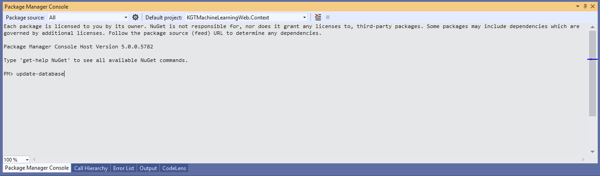
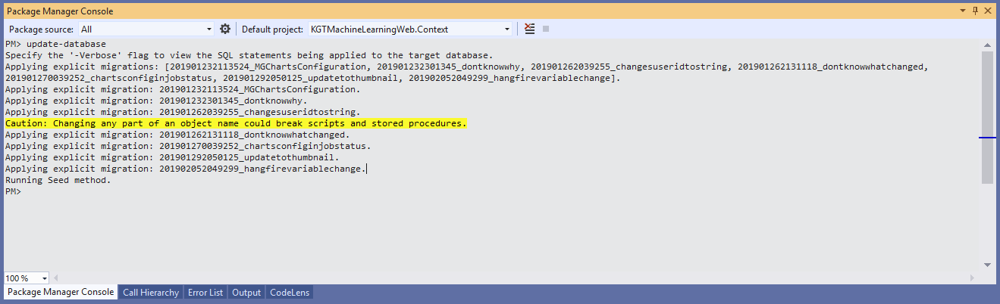

# KGTLearningMachineWeb

This is the Master Thesis project of Xhulio Kondakciu. This application creates a dynamic interactive interface for displaying different set of charts and graphs. The purpose is to display in an interactive way data of Deep Neural Networks for time series.

## Getting Started

These instructions will get you a copy of the project up and running on your local machine for development and testing purposes. See deployment for notes on how to deploy the project on a live system.

### Prerequisites

To run this application Node.js is a prerequesite. Download and install the latest version from here https://nodejs.org/en/

After Node.js is installed highcharts export server need to be installed next. Run this command in the command promt and make sure it will get installed for all users

```
npm install highcharts-export-server -g
```

* Agree to the license terms
* Select highcharts version 7.0.2
* Select default value for all other options

If thumbnails are not being created after deployment check if the highcharts-export-server command is available to the user under which the web page is running in IIS 

## How to fix Highcharts trial expired

### Fix for highcharts export server

npm uninstall highcharts-export-server -g
npm install highcharts-export-server -g
iisreset

### Fix for highcharts .NET wrapper

During development period the trial version of Highcharts is used. This will be changes later to a licensed version after the development is done. But during the meatime the highcharts .NET wrapper will have its trial expire after one month of usage. This issue can be detected if after uploading a file to be processed on the workspace the thumbnail of the chart is empty and the chart can't be opend. Opening the the developer tools of the browser and checking the errors will also confirm this. On the request response when opening the chart you should see the message that the trial has expired. To fix this issue this step should be followed:

* Uninstall the Highsoft.Highcharts nuget package from all the projects where it is used
    * DataVisualization
    * DataVisualization.Common
    * DataVisualization.config
    * DataVisualization.Domain
    * DataVisualization.Models
* Install latest version of Highsoft.Highcharts nuget package to all the projects again
    * DataVisualization
    * DataVisualization.Common
    * DataVisualization.config
    * DataVisualization.Domain
    * DataVisualization.Models
* Clean solution
* Rebuild solution
* Re-deploy application

### On build server

* locate local nuget.exe CLI cmd tool (e.g. C:\TeamCity\buildAgent\tools\NuGet.CommandLine.4.8.1\tools)
* run: nuget locals all -clear
* clear the checkout and build dirs for affected build configuration

## Deployment

### Creating the database

The project uses Entity Framework code first approach for managing the database. To create the database first put the correct connection string into the project Web.config in the root of DataVisualization.

Then open the project into Visual Studio and open Package Manager Console. In the console select as default project DataVisualization.Context. Into the console type **update-database** and press enter.



This will create the database based on the connection string and also create all the tables. It will also run the seed method which will add some initial data into the database.



### Updating the database schema ####

As mentioned previously the project uses the code first approach in creating the database schema. The table models are all saved in project **DataVisualization.Models**. 

To add a new table create a new class in this project and than go to the class KGTContext in **DataVisualization.Context** and add property

```
public DbSet<MyNewTable> MyNewTable { get; set; }
```

To update an existing table just change the coresponding Model for the table.

After adding new models or updating existing one to update the database open again Package Manager Console in visual studio and type

```
add-migration MigrationName
```
Followed by
```
update-database
```
This will first create a database migration which will add the code for adding or updating tables. Than the update-database command will apply the new changes to the database.

The code will run fine at first and update the database schema but it will show an error message later when it tries to seed the database, some of the data that the seed tries to add already exist if it was run when the database was created. Ignore this error or comment everything inside the _Seed_ method in the class _Configuration_. 

Congratulations now you have a database for the project!

### Deploying the application ###

The application is deployed as a normal ASP.NET MVC web application.

## Authors

* **Xhulio Kondakciu**

